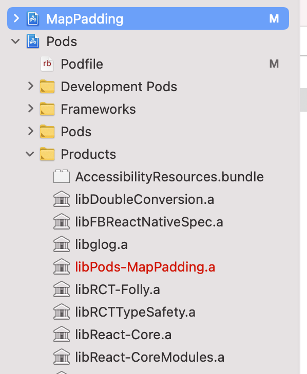

# Installation

1. Open `index.js` and paste in the proper access token.
2. Run `npm install`.
3. Open Xcode, and build and run.

# Explanation

In `ios/Podfile`, setting `ReactNativeMapboxGLIOSVersion` to `6.3.0` causes the following error when building in Xcode:

> Library not found for -lPods-MapPadding

and sure enough, the linked libraries related to this project do not exist:

Setting the value instead to `6.2.1` causes the project to build correctly with no errors.